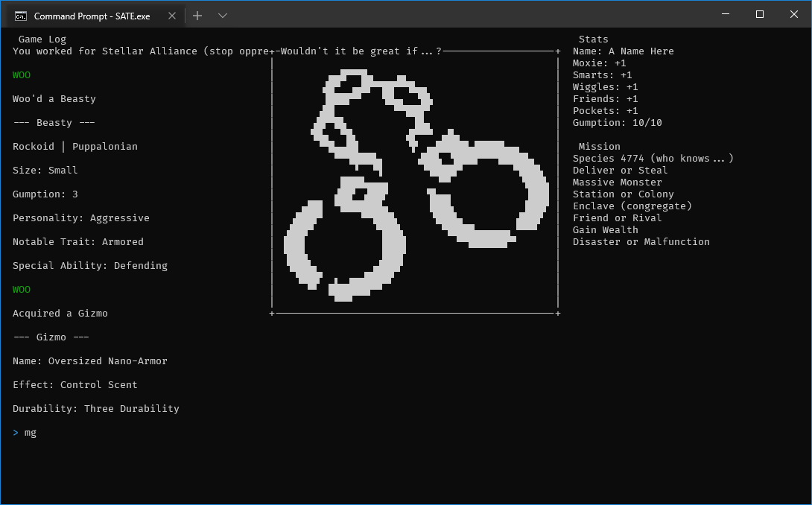
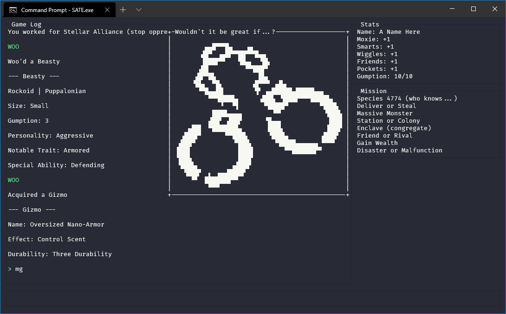
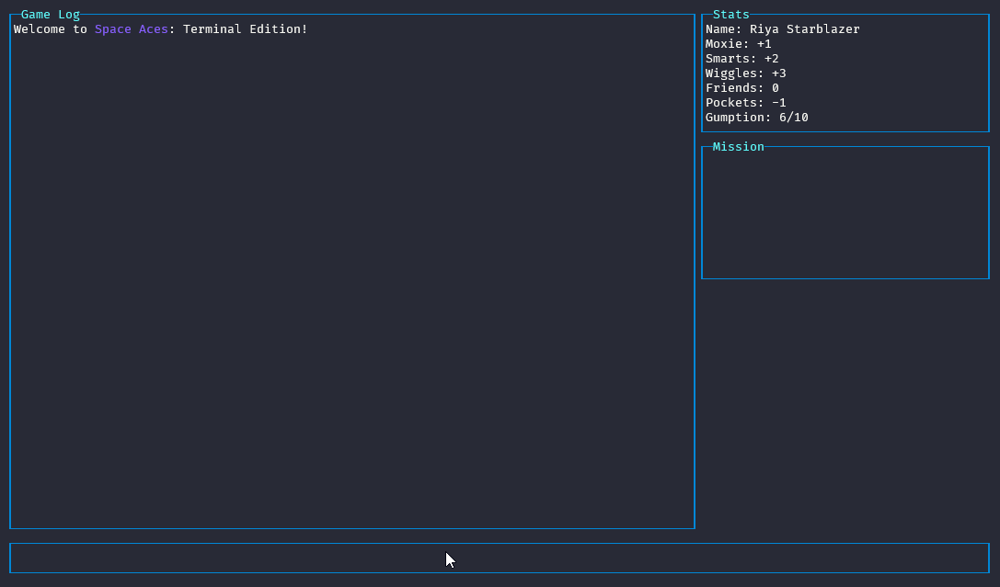

# Space Aces: Terminal Edition (SATE)
SATE is based on [Space Aces: TNG](https://www.drivethrurpg.com/product/346728/Space-Aces-TNG-The-New-Guidebook).

It allows you to play Space Aces in a terminal window, or on a remote server if desired.

## How to Play
- Download the [latest release](https://github.com/joshschmille/sate/releases/tag/latest) for your desired OS.
- Extract the archive using your preferred tool (7zip, WinRAR, etc.).
- Run the executable (SATE.exe / SATE) from within your terminal.
- Use the `help` command in the game for more direction, if needed.

### Character Modification
The majority of the commands provided within SATE will simply use the oracles within SA to generate an outcome for you. You also have the `log` command to output any content to the log, which I use for pretty much everything. However, there is also the `character` command, which allows you to change the data within the stats block on the top-right. This command works a little differently than the others.

To change a given field, simply supply it, and the new content using the `character` command, for example:

- `character moxie +2` will set the `Moxie` field to `+2`.
- `character name Willy Washington` will set the `Name` field to `Willy Washington`.

### Windows Users
I highly recommend using [Windows Terminal](https://www.microsoft.com/en-us/p/windows-terminal/9n0dx20hk701) instead of simply double-clicking on `SATE.exe`, as the rendering within `cmd.exe` (the standard command prompt) is not great.

Once Windows Terminal is installed, you can navigate to the directory where SATE.exe and its data/logs folders are (usind `cd` commands), then run `SATE.exe` from there.

This should look something like this:

To get it looking better, try various out some color schemes for your terminal!

I personally use [Dracula](https://draculatheme.com/windows-terminal), and it looks like this under Windows:

Please keep in mind that colors will vary from terminal to terminal. If it has a negative impact on the functionality, please [create an issue](https://github.com/joshschmille/sate/issues) letting me know what terminal & OS you are using, and include a screenshot if possible.

## Tips
- The `help` command will output every single top level command available.
- The game log window can be scrolled with your `Up` and `Down` arrow keys.
- You can toggle the `macguffin` panel's visibility with `Ctrl-x`.

## A Demo GIF!

