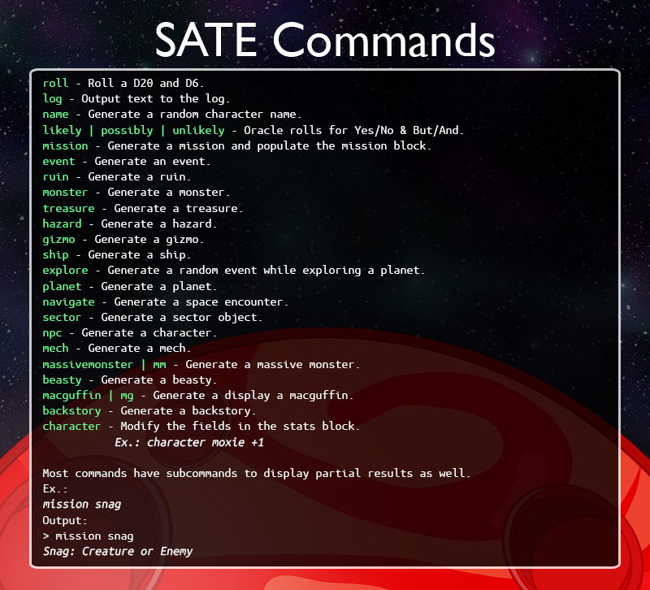

# Space Aces: Terminal Edition (SATE)
SATE is based on [Space Aces: TNG](https://www.drivethrurpg.com/product/346728/Space-Aces-TNG-The-New-Guidebook).

It allows you to play Space Aces in a terminal window, or on a remote server if desired.

## Features
- Terminal based interface for maximum portability. You can even play remotely over SSH!
- Persistent character status information. It saves every time you make a change.
- Logging of all input and output for referencing later.

## Future Plans
- Self-updating to enable easy ways to stay up to date with the latest additions & changes.
- Better logging formatting. I'd like to have the output log be formatted as Markdown to make it more portable.
- More to come!

## How to Play
### Overview
- Download the [latest release](https://github.com/joshschmille/sate/releases/tag/latest) for your desired OS.
- Extract the archive using your preferred tool (7zip, WinRAR, etc.).
- Run the executable (SATE.exe / SATE) from within your terminal.
- Use the `help` command in the game for more direction, if needed.

### OS Specific Instructions
#### Windows
***First, I highly recommend installing something like [Windows Terminal](https://www.microsoft.com/en-us/p/windows-terminal/9n0dx20hk701) instead of using the built-in Windows command prompt. It will work, but colors are not supported.***
- Download the latest release for Windows [here](https://github.com/joshschmille/sate/releases/tag/latest).
- Extract the file wherever you choose, but make note of where you put it.
- Within your terminal, navigate to the directory where you extracted SATE to. (Ex.: `cd C:\Users\Josh\Downloads\SATE-windows-amd64`).
- Type `SATE` and hit `Enter`.

This should look something like this:

To get it looking better, try various out some color schemes for your terminal!

I personally use [Dracula](https://draculatheme.com/windows-terminal), and it looks like this under Windows:

Please keep in mind that colors will vary from terminal to terminal. If it has a negative impact on the functionality, please [create an issue](https://github.com/joshschmille/sate/issues) letting me know what terminal & OS you are using, and include a screenshot if possible.

#### Mac
[TODO]

#### Linux
- Within your terminal, download the latest release: `wget https://github.com/joshschmille/sate/releases/download/latest/SATE-linux-amd64.tar.gz`
- Extract the file using `tar -xzvf SATE-linux-amd64.tar.gz`.
- Run `./SATE-linux-amd64`

### Character Modification
The majority of the commands provided within SATE will simply use the tables & oracles within SA to generate an outcome for you. You also have the `log` command to output any content to the log, which I use for pretty much everything.

There is also the `character` command, which allows you to change the data within the character block on the top-right. This command works a little differently than the others.

To change a given field, specify which one you want to modify, and the new content using the `character` command, for example:

- `character moxie +2` will set the `Moxie` field to `+2`.
- `character name Willy Washington` will set the `Name` field to `Willy Washington`.

### Commands

## Tips
- The `help` command will output every single top level command available.
- The game log window can be scrolled with your `Up` and `Down` arrow keys.
- You can toggle the `macguffin` panel's visibility with `Ctrl-x`.

## A Demo GIF!

*This demo was recorded in a Windows Terminal window, using Dracula colors, and inside WSL (Ubuntu).*
